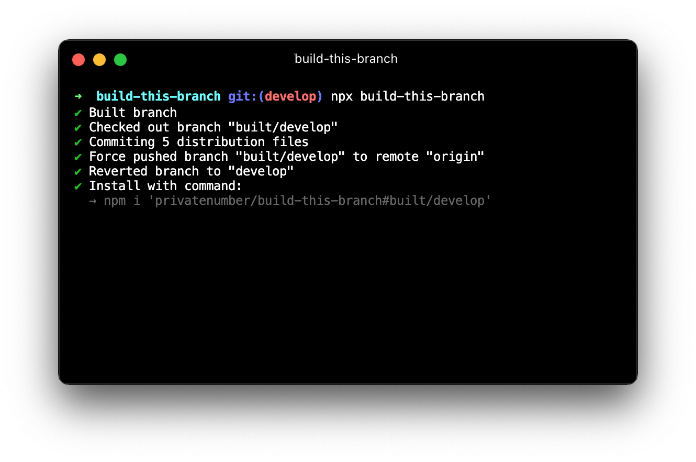

# build-this-branch

<p align="center">
	
</p>

Script to automate creating _built branches_.

<sub>Support this project by ⭐️ starring and sharing it. [Follow me](https://github.com/privatenumber) to see what other cool projects I'm working on! ❤️</sub>

## Usage

Run in your Git repository from the branch you want to build:

```sh
npx build-this-branch
```

> **⚠️ Warning:** This command will force-push to the remote branch `built/<current branch>`. Make sure there are no unsaved changes there. You can configure the built branch name with `--built-branch <branch name>`.


### Global install
If you use this command often, make sure to install it globally so it's on disk:

```sh
npm install -g build-this-branch
```

### Flags
| Flag | Description |
| - | - |
| `-c, --build-command <command>` | The command to build the branch. (default: `npm run build`) |
| `-b, --built-branch <branch name>` | The name of the built branch. Defaults to prefixing "built/" to the current branch. |
| `-r, --remote <remote>` | The remote to push to. (default: `origin`) |
| `-d, --dry` | Dry run mode. Will not build, commit, or push to the remote. |
| `-h, --help` | Show help |
| `-v, --version` | Show version |

## FAQ

### What's a built branch?

In projects that build from source files, a _built branch_ is a branch that contains built assets so it can be installed with [npm](https://docs.npmjs.com/cli/v8/commands/npm-install#:~:text=npm%20install%20%3Cgithubname%3E%2F%3Cgithubrepo%3E%5B%23%3Ccommit-ish%3E%5D):

```sh
npm install 'organization/repository#built-branch'
```

Built branches are useful for quickly testing changes and can be preferrable over permanently publishing a prerelease to npm.

### What does this script do?

To make a _built branch_, this script does the following:

1. Run build script (eg. `npm run build`)
2. Create a new branch with the `built/` namespace
3. [Detects](https://github.com/npm/npm-packlist) and only commits npm publish files to the new branch
4. Force pushes up to remote
5. Deletes local built branch
6. Prints the installation command for the built branch
