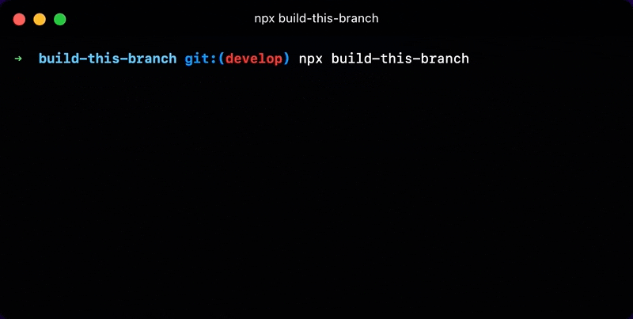

# build-this-branch

<p align="center">
	
</p>

Script to automate creating [_built branches_](#whats-a-built-branch) for testing npm packages without publishing to npm.

<sub>Support this project by ⭐️ starring and sharing it. [Follow me](https://github.com/privatenumber) to see what other cool projects I'm working on! ❤️</sub>

## Usage

Run in your npm package Git repository from the branch you want to build:

```sh
npx build-this-branch
```

> **⚠️ Warning:** This command will force-push to the remote branch `built/<current branch>`. Make sure there are no unsaved changes there. You can configure the built branch name with `--built-branch <branch name>`.


### Global install
If you use this command often, install it globally so it's on disk:

```sh
npm install -g build-this-branch
```

When globally installed, you can use it without `npx`:
```sh
build-this-branch
```


### Flags
| Flag | Description |
| - | - |
| `-c, --build-command <command>` | The command to build the branch. (default: `npm run build`) |
| `-b, --built-branch <branch name>` | The name of the built branch. Defaults to prefixing "built/" to the current branch or tag name. |
| `-r, --remote <remote>` | The remote to push to. (default: `origin`) |
| `-d, --dry` | Dry run mode. Will not build, commit, or push to the remote. |
| `-h, --help` | Show help |
| `--version` | Show version |

## FAQ

### What's a built branch?
A _built branch_ is a Git branch that contains published assets so it can be installed with [npm](https://docs.npmjs.com/cli/v8/commands/npm-install#:~:text=npm%20install%20%3Cgithubname%3E%2F%3Cgithubrepo%3E%5B%23%3Ccommit-ish%3E%5D) from GitHub:

```sh
# Installs from github.com/organization/repository/tree/built-branch
npm install 'organization/repository#built-branch'
```

Built branches are useful for quickly testing changes and can be preferrable over permanently publishing a prerelease to npm.

### When would I use this?
When you want to test-install an in-development npm package by publishing it to a GitHub branch instead of npm.

> _But you can prepublish private test packages on npm too!_

Personally, I prefer to use GitHub + Git over npm for testing packages because I'll have more control with better "prepublish" management.

A _built branch_ is impermanent because it constantly gets force-pushed, and the branch can be easily deleted via commandline or GitHub UI. On top of that, it's easily sharable by link—to install or to look at the source.

npm requires version bumping every test package, has a strict [Unpublish policy](https://docs.npmjs.com/policies/unpublish), and does not make it easy to view the code before installing.

Use-cases:
- When you want to test a new package that isn't ready to be published on npm.
- When you're contributing to an open source project, and you want to test the changes.
- When you want to avoid using `npm link` because of symlink complexities.
- When you can't install locally via `npm install <project path>` or `npm pack` + `npm install <tarball>` (eg. testing in remote environment or providing a shareable test package).

### How is this different from simply committing distribution files to a branch?

You can accomplish something similar by manually running the following commands:
```
$ npm run build
$ git add --force dist
$ git commit -nam built
$ git push
```

However, this will not yield the same exact output as `npm publish` because:
- There can be missing distribution files (eg. files outside of `dist`). _build-this-branch_ uses [npm-packlist](https://github.com/npm/npm-packlist) —the same library `npm publish` uses—to detect publish files declared via `package.json#files` and `.npmignore`.
- Irrelevant files are committed (eg. source files). This can slow down installation or even interfere with the library behavior. For example, if your project has development configuration files, they can accidentally be read by the dependent tooling.

- npm hooks are not executed. _build-this-branch_ simulates package packing and runs hooks `prepare` and `prepack`.

### What exactly does this script do?

This script does the following to make a _built branch_:

1. Run build script (eg. `npm run build`)
2. Run "prepare" & "prepack" [npm hooks](https://docs.npmjs.com/cli/v8/using-npm/scripts)
3. Create a new branch with the `built/` namespace
4. [Detects](https://github.com/npm/npm-packlist) and only commits npm publish files to the new branch
5. Force pushes up to remote
6. Deletes local built branch
7. Prints the installation command for the built branch

### Can I install from a built branch hosted on a private repository?

Yes, if it's being installed from a Git client that's authorized to access the private repository.

Although it won't be possible if the client doesn't have access, if you're comfortable publishing the built assets to a branch on another repository (given it's minified, mangled), you can use the `--remote <remote>` flag to push to another repository that the client has access to.

#### User story
You want to test a built branch hosted on a private repository _Repo A_, but GitHub Actions on the consuming project _Repo B_ doesn't have access to the private repository so `npm install` fails.

To work around this, you push the built branch to _Repo B_ to install it from there:

```sh
$ npx build-this-branch --remote git@github.com:repo-b.git --branch test-pkg

✔ Successfully built branch! Install with command:
  → npm i 'repo-b#test-pkg'
```

### Is it possible to use for packages that don't have a build step?

Yes. _build-this-branch_ can be useful for packages that don't have a build step because it filters out non-publish files.

Creating a banch only with publish files will make bring the testing environment closer to the publish environment.

To use in a project without a build step, pass in an empty build command:
```
$ npx build-this-branch -c
```
